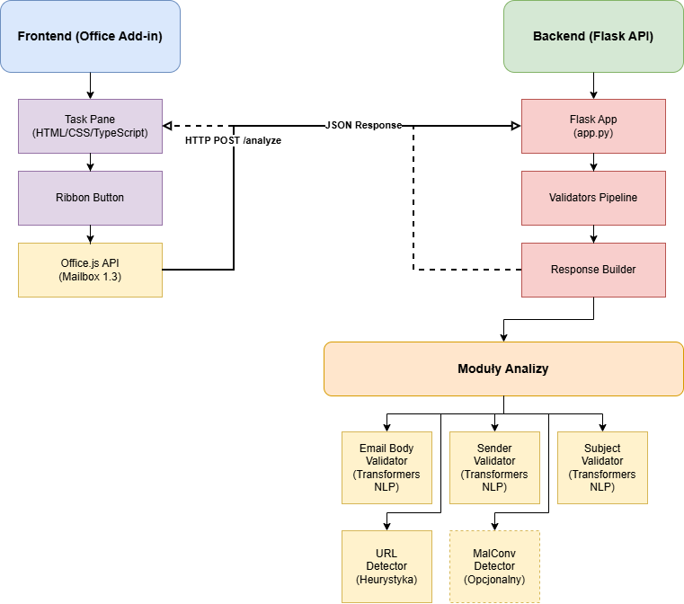
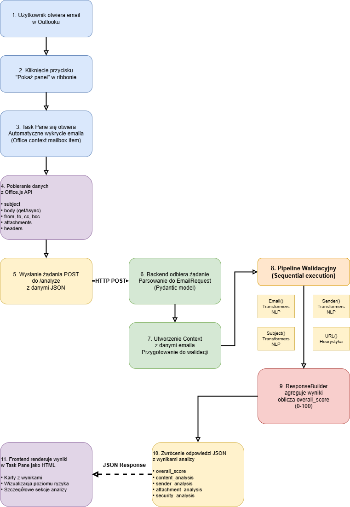
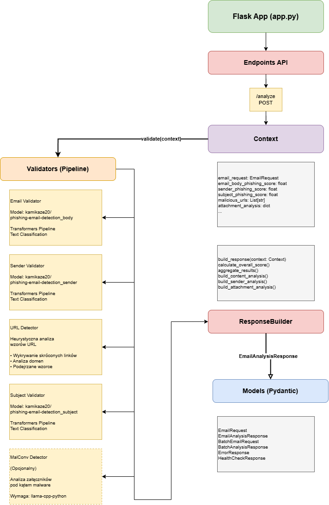

## Wstęp

Email jest jednym z najważniejszych narzędzi komunikacyjnych zarówno w biznesie jak i życiu prywatnym. Niestety, wraz z jego popularnością rośnie też liczba zagrożeń - phishing, złośliwe oprogramowanie czy oszustwa internetowe. Codziennie otrzymujemy dziesiątki emaili i trudno jest ręcznie sprawdzać każdy z nich pod kątem bezpieczeństwa.

Celem tego projektu było stworzenie narzędzia, które automatycznie analizuje bezpieczeństwo emaili bezpośrednio w Outlooku. Zamiast kopiować treść do zewnętrznych narzędzi, użytkownik może po prostu kliknąć przycisk i od razu zobaczyć szczegółową analizę bezpieczeństwa.

System składa się z dwóch głównych części:
- **Frontend** - dodatek do Outlooka (Office Add-in) napisany w TypeScript, który wyświetla panel boczny z wynikami analizy
- **Backend** - serwer Flask w Pythonie, który wykorzystuje modele uczenia maszynowego do analizy treści emaili

Do wykrywania zagrożeń używamy pre-trenowanych modeli NLP z Hugging Face oraz własnych algorytmów heurystycznych do analizy linków i załączników.

## 1. Architektura Systemu

System działa w architekturze klient-serwer. Frontend komunikuje się z backendem przez HTTP, wysyłając dane emailowe w formacie JSON i otrzymując wyniki analizy.



*Rysunek 1: Ogólna architektura systemu*

### 1.1. Komponenty Systemu

**Frontend (Office Add-in)**
Frontend to dodatek do Outlooka napisany w TypeScript. Składa się z:
- Task Pane - panel boczny, który się otwiera po kliknięciu przycisku w ribbonie
- Ribbon Button - przycisk "Pokaż panel" w pasku narzędzi Outlooka
- Office.js API - do pobierania danych z aktualnie otwartego emaila
- Interfejs wyświetlający wyniki analizy w formie kart

**Backend (Flask API)**
Backend to serwer Flask działający na porcie 5000. Oferuje trzy endpointy:
- `/analyze` - główny endpoint do analizy pojedynczego emaila
- `/analyze/batch` - analiza wielu emaili naraz (nie używany w obecnej wersji)
- `/health` - sprawdzanie czy serwer działa

**Moduły Analizy**
Backend składa się z kilku modułów (validatorów), które analizują różne aspekty emaila:
- Email Body Validator - używa modelu NLP do analizy treści
- Sender Validator - analizuje adres nadawcy
- Subject Validator - sprawdza temat emaila
- Malicious URL Detector - wykrywa podejrzane linki (bez ML, tylko heurystyka)
- MalConv Detector - analiza załączników (opcjonalny, bo wymaga kompilacji C++)

## 2. Technologie i Narzędzia

### 2.1. Frontend

**Office.js**
To oficjalna biblioteka Microsoft do tworzenia dodatków do Office. Użyłem wersji 1.3 API, która daje dostęp do danych emailowych. Najważniejsze funkcje które wykorzystałem:
- `Office.context.mailbox.item` - dostęp do aktualnie otwartego emaila
- `item.body.getAsync()` - pobieranie treści emaila (asynchronicznie)
- `item.attachments` - lista załączników
- `item.internetHeaders.getAllAsync()` - nagłówki emaila

**TypeScript (5.4.2)**
Wybrałem TypeScript zamiast zwykłego JavaScript, bo daje lepsze wsparcie w IDE i pomaga unikać błędów. Kod kompiluje się do JavaScript przez Babel.

**Webpack (5.95.0)**
Używam Webpacka do bundlowania całej aplikacji. Konfiguracja jest standardowa - kompiluje TypeScript, łączy pliki HTML/CSS i uruchamia dev server na porcie 3000 z HTTPS (wymagane przez Office Add-ins).

**HTML/CSS**
Interfejs jest napisany w zwykłym HTML5 i CSS3. Użyłem też Fluent UI (Office UI Fabric) do podstawowych stylów, żeby wyglądało spójnie z Outlookiem.

**Node.js (24.0.0)**
Środowisko do uruchamiania frontendu. Uwaga - Node 24 jest bardzo nowy i miałem problemy z niektórymi narzędziami Office (np. sideloading), ale ostatecznie wszystko działało.

### 2.2. Backend

**Flask (3.0.0)**
Wybrałem Flask bo jest prosty i lekki. Wystarczy do stworzenia REST API z trzema endpointami. Nie potrzebowałem większego frameworka jak Django.

**Flask-CORS (4.0.0)**
Musiałem dodać CORS, bo frontend działa na `https://localhost:3000`, a backend na `http://127.0.0.1:5000` - przeglądarka blokuje takie żądania bez odpowiednich nagłówków.

**Transformers (Hugging Face)**
To główna biblioteka do ML w projekcie. Użyłem trzech pre-trenowanych modeli z Hugging Face:
- `kamikaze20/phishing-email-detection_body` - analizuje treść emaila
- `kamikaze20/phishing-email-detection_sender` - analizuje adres nadawcy  
- `kamikaze20/phishing-email-detection_subject` - analizuje temat

Modele ładują się przy starcie aplikacji, co zajmuje trochę czasu (około 10-15 sekund), ale potem działają szybko.

**PyTorch**
Transformers wymaga PyTorch jako backendu. Zainstalowałem wersję CPU, bo nie mam GPU i nie potrzebuję akceleracji sprzętowej dla tego projektu.

**Python 3.14.2**
Użyłem najnowszej wersji Pythona. To spowodowało problemy - TensorFlow nie wspiera Python 3.14, więc musiałem zrobić moduł MalConv opcjonalnym. Ostatecznie system działa bez niego, więc nie było to duże ograniczenie.

### 2.3. Narzędzia Deweloperskie

**Office Add-in CLI Tools**
- `office-addin-debugging` (6.0.3) - narzędzie do debugowania i sideloadowania add-inów
- `office-addin-dev-certs` (2.0.3) - generowanie certyfikatów SSL dla development servera
- `office-addin-lint` (3.0.3) - linter dla kodu Office Add-in
- `office-addin-manifest` (2.0.3) - walidacja manifestu add-in

**Node.js**
- Wersja: 24.0.0
- Środowisko uruchomieniowe JavaScript
- Wykorzystywane do budowania i uruchamiania frontendu

## 3. Struktura Projektu

### 3.1. Frontend

Struktura katalogów:

```
frontend/
├── src/
│   ├── taskpane/
│   │   ├── taskpane.html      # HTML panelu bocznego
│   │   ├── taskpane.ts        # Logika TypeScript
│   │   └── taskpane.css       # Style CSS
│   └── commands/
│       └── commands.ts         # Funkcje dla przycisków (puste)
├── assets/                     # Ikony
├── manifest.json               # Konfiguracja add-inu
├── webpack.config.js           # Webpack
├── package.json                # Zależności npm
└── tsconfig.json               # TypeScript config
```

Najważniejsze pliki:
- `manifest.json` - tutaj definiuję całą konfigurację add-inu (przyciski, uprawnienia, itp.)
- `taskpane.html` - struktura HTML panelu z przyciskiem i kontenerem na wyniki
- `taskpane.ts` - główna logika: pobieranie danych z Outlooka, wysyłanie do backendu, renderowanie wyników
- `taskpane.css` - style, głównie przycisk i karty z wynikami

### 3.2. Backend

Struktura katalogów:

```
backend/
├── app.py                      # Flask app - endpointy API
├── models/
│   └── models.py              # Modele Pydantic (EmailRequest, Response, itp.)
├── service/
│   ├── context.py             # Context - przechowuje stan analizy
│   ├── validator.py           # Abstrakcyjna klasa Validator
│   ├── response_builder.py   # Buduje odpowiedź z wyników
│   ├── phising/              # Moduły phishing (literówka w nazwie folderu!)
│   │   ├── email.py          # Analiza treści
│   │   ├── sender.py         # Analiza nadawcy
│   │   └── subject.py        # Analiza tematu
│   ├── url/
│   │   └── MaliciousUrlDetector.py  # Wykrywanie linków
│   ├── malware/
│   │   └── malconv.py        # Analiza załączników (opcjonalny)
│   └── fraud/
│       └── fraud_detection.py  # Nieużywany moduł
├── requirements.txt           # Zależności Python
└── README.md
```

Najważniejsze pliki:
- `app.py` - tutaj są wszystkie endpointy (`/health`, `/analyze`, `/analyze/batch`), konfiguracja CORS i inicjalizacja pipeline'u
- `models/models.py` - modele Pydantic do walidacji żądań i odpowiedzi
- `service/context.py` - klasa Context przechowuje dane wejściowe i wszystkie wyniki pośrednie
- `service/validator.py` - abstrakcyjna klasa, wszystkie moduły analizy dziedziczą z niej
- `service/response_builder.py` - zbiera wyniki z wszystkich validatorów i buduje końcową odpowiedź JSON

Uwaga: folder nazywa się `phising` zamiast `phishing` - to literówka, ale już za późno żeby zmieniać, wszystko działa.

## 4. Przepływ Danych i Komunikacja



*Rysunek 2: Przepływ danych od otwarcia emaila do wyświetlenia wyników*

### 4.1. Przepływ Analizy Pojedynczego Emaila

Kiedy użytkownik chce przeanalizować email, dzieje się następująco:

1. **Kliknięcie przycisku** - użytkownik otwiera email w Outlooku i klika "Pokaż panel" w ribbonie
2. **Otwarcie Task Pane** - panel boczny się otwiera po prawej stronie
3. **Pobieranie danych z Outlooka** - frontend używa Office.js API do zebrania wszystkich danych:
   - Temat, treść, nadawca, odbiorcy
   - Data wysłania
   - Załączniki (nazwa, rozmiar, typ)
   - Nagłówki emaila (jeśli dostępne)
4. **Wysłanie żądania** - frontend wysyła POST do `http://127.0.0.1:5000/analyze` z danymi w JSON
5. **Backend przetwarza** - Flask odbiera żądanie i tworzy obiekt `Context`
6. **Pipeline walidacyjny** - Context przechodzi przez wszystkie moduły analizy:
   - Email Body Validator - analizuje treść przez model NLP
   - Sender Validator - sprawdza nadawcę
   - Subject Validator - analizuje temat
   - Malicious URL Detector - szuka podejrzanych linków
   - MalConv Detector - analizuje załączniki (jeśli dostępny)
7. **Agregacja wyników** - ResponseBuilder zbiera wszystkie wyniki i liczy ogólny score (0-100)
8. **Odpowiedź** - backend zwraca JSON z wynikami
9. **Wyświetlenie** - frontend renderuje wyniki w panelu jako karty z różnymi sekcjami

### 4.2. Format Komunikacji

Frontend wysyła dane emailowe w JSON, backend zwraca wyniki też w JSON.

**Przykładowe żądanie:**
```json
{
  "subject": "URGENT: Your account will be closed",
  "body": "Click here to verify...",
  "from": "noreply@example.com",
  "to": "user@example.com",
  "cc": [],
  "bcc": [],
  "reply_to": "",
  "date": "2024-01-01T12:00:00Z",
  "attachments": [
    {
      "filename": "document.pdf",
      "size": 1024,
      "content_type": "application/pdf"
    }
  ],
  "headers": {}
}
```

**Przykładowa odpowiedź:**
```json
{
  "overall_score": 75,
  "content_analysis": {
    "subject_has_suspicious_keywords": true,
    "body_has_suspicious_keywords": true,
    "subject_has_urls": false,
    "body_has_urls": true,
    "body_urls": ["http://suspicious.com"],
    "subject_uppercase_ratio": 0.8
  },
  "sender_analysis": {
    "from": "noreply@example.com",
    "from_valid": true,
    "from_domain": "example.com",
    "reply_to_different": false
  },
  "attachment_analysis": {
    "count": 1,
    "has_executables": false,
    "has_scripts": false,
    "suspicious_extensions": [],
    "total_size": 1024
  },
  "security_analysis": {
    "suspicious_indicators": ["Podejrzane słowa w temacie"],
    "flags": ["HIGH_RISK"]
  }
}
```

Backend waliduje żądanie przez Pydantic - jeśli coś jest nie tak, zwraca błąd 400.

## 5. Moduły Analizy



*Rysunek 3: Szczegółowa struktura modułów backendu*

### 5.1. Email Body Validator

Ten moduł używa modelu `kamikaze20/phishing-email-detection_body` z Hugging Face. Model został wytrenowany do wykrywania phishingu w treści emaili.

Jak działa:
- Wysyłam całą treść emaila do modelu przez pipeline `text-classification`
- Model zwraca wynik od 0 do 1 (powyżej 0.5 = phishing)
- Wynik zapisuję w `context.email_body_phishing_score`

Model ładuje się przy starcie aplikacji i zajmuje trochę pamięci, ale działa szybko przy analizie.

### 5.2. Sender Validator

Analizuje adres nadawcy używając modelu `kamikaze20/phishing-email-detection_sender`. Model sprawdza czy adres email wygląda podejrzanie (np. dziwne domeny, literówki w nazwach firm).

Wynik też jest od 0 do 1 i zapisuje się w `context.sender_phishing_score`.

### 5.3. Subject Validator

Używa modelu `kamikaze20/phishing-email-detection_subject` do analizy tematu. Temat często zdradza phishing - np. "URGENT!" albo "Your account will be closed".

Dodatkowo liczę stosunek wielkich liter do małych - jeśli temat jest w całości WIELKIMI LITERAMI, to podejrzane.

### 5.4. Malicious URL Detector

Ten moduł nie używa ML, tylko heurystyki. Sprawdzam:
- Czy link jest skrócony (bit.ly, tinyurl.com) - często używane w phishing
- Czy domena wygląda podejrzanie
- Czy struktura URL jest dziwna

Wszystkie znalezione podejrzane linki zapisuję w `context.malicious_urls`.

### 5.5. MalConv Detector (Opcjonalny)

Ten moduł miał analizować załączniki pod kątem malware, ale wymaga biblioteki `llama-cpp-python` która potrzebuje kompilatora C++. 

Zrobiłem go opcjonalnym - jeśli biblioteka nie jest zainstalowana, system po prostu pomija analizę załączników i działa dalej. W praktyce większość zagrożeń wykrywam przez analizę treści i linków, więc brak tego modułu nie jest dużym problemem.

## 6. Interfejs Użytkownika

### 6.1. Task Pane

Panel boczny wyświetla się po prawej stronie Outlooka. Zawiera:
- Nagłówek "Analiza Bezpieczeństwa Emaila"
- Przycisk "Analizuj Email" z ikoną zegara
- Wskaźnik ładowania (spinner) podczas analizy
- Kontener z wynikami - wszystko generowane dynamicznie w HTML

### 6.2. Wizualizacja Wyników

Wyniki pokazuję w formie kart:

1. **Główna karta z wynikiem** - pokazuje ogólny score (0-100) i poziom ryzyka:
   - Zielony = bezpieczny (<40)
   - Pomarańczowy = średnie ryzyko (40-70)
   - Czerwony = wysokie ryzyko (>70)
   - Pasek postępu wizualizujący score
   - Komunikat z rekomendacją

2. **Wykryte zagrożenia** - lista wszystkich podejrzanych rzeczy

3. **Analiza treści** - podejrzane słowa, linki, użycie wielkich liter

4. **Analiza nadawcy** - adres email, domena, czy Reply-To się różni

5. **Analiza załączników** - ile jest, czy są wykonywalne, podejrzane rozszerzenia

6. **Odbiorcy** - statystyki kto dostał email

7. **Flagi bezpieczeństwa** - tagi z różnymi flagami

### 6.3. Styl

Zrobiłem minimalistyczny design:
- Białe tło (wymuszone przez `!important`, bo Outlook ma ciemny motyw)
- Delikatne cienie i zaokrąglone rogi
- Kolory zależne od ryzyka (zielony/pomarańczowy/czerwony)
- Bez emotek - czysto i profesjonalnie
- Font Segoe UI dla czytelności

## 7. Integracja z Outlookiem

### 7.1. Manifest Add-in

Plik `manifest.json` to konfiguracja całego add-inu. Najważniejsze rzeczy:
- Unikalny ID add-inu (UUID)
- Nazwa i opis
- Uprawnienia: `MailboxItem.Read.User` - tylko odczyt emaili
- TaskPaneRuntime - definicja panelu bocznego
- Ribbon - przycisk "Pokaż panel" w grupie "Analiza Bezpieczeństwa"

Przycisk pokazuje się tylko podczas czytania emaili (`mailRead` context).

### 7.2. Office.js API

Używam kilku funkcji z Office.js:
- `Office.onReady()` - czekam aż API jest gotowe
- `Office.context.mailbox.item` - dostęp do aktualnego emaila
- `item.body.getAsync()` - pobieranie treści (asynchronicznie, bo może być długie)
- `item.attachments` - lista załączników
- `item.internetHeaders.getAllAsync()` - nagłówki (jeśli dostępne)

Wszystko jest asynchroniczne, więc muszę używać callbacków lub Promise.

### 7.3. Sideloading

Żeby przetestować add-in lokalnie, trzeba go "sideloadować" w Outlooku. Użyłem narzędzia `office-addin-debugging` do tego. Trzeba było wygenerować certyfikaty SSL dla dev servera (`office-addin-dev-certs`).

## 8. Bezpieczeństwo i Obsługa Błędów

### 8.1. Obsługa Błędów Frontendu

Frontend obsługuje różne błędy:
- Jeśli nie można pobrać danych z Outlooka - pokazuje komunikat w panelu
- Jeśli backend nie odpowiada - sprawdza czy serwer działa i pokazuje odpowiedni komunikat
- Jeśli odpowiedź z API jest nieprawidłowa - waliduje JSON i obsługuje błędy parsowania

Wszystkie błędy są wyświetlane w czytelnej formie dla użytkownika.

### 8.2. Obsługa Błędów Backendu

Backend ma kilka poziomów obsługi błędów:
- Błędy parsowania żądania (nieprawidłowy JSON) - zwraca 400 z opisem
- Błędy w validatorach - loguje błąd, ale kontynuuje analizę z innymi modułami
- Błędy serwera - zwraca 500 z komunikatem
- Wszystko jest logowane przez Python logging (poziomy INFO/ERROR)

Jeśli jeden moduł się wywali, reszta nadal działa.

### 8.3. CORS

Musiałem skonfigurować CORS, bo frontend działa na `https://localhost:3000`, a backend na `http://127.0.0.1:5000`. Przeglądarka blokuje takie żądania bez odpowiednich nagłówków. Flask-CORS rozwiązuje ten problem.

## 9. Wnioski

Projekt udało się zrealizować i system działa. Największe wyzwania:

**Problemy które napotkałem:**
- Python 3.14 jest bardzo nowy i niektóre biblioteki (np. TensorFlow) jeszcze go nie wspierają - musiałem zrobić MalConv opcjonalnym
- Office Add-ins wymagają HTTPS nawet w development - trzeba było skonfigurować certyfikaty
- Modele NLP ładują się długo przy starcie (10-15 sekund), ale potem działają szybko
- CORS był problemem na początku - musiałem dodać Flask-CORS

**Co działa dobrze:**
- Integracja z Outlookiem przez Office.js działa płynnie
- Modele NLP wykrywają phishing dość skutecznie
- Interfejs jest czytelny i pokazuje wszystkie potrzebne informacje
- Architektura jest modularna - łatwo dodać nowe moduły analizy

**Co można poprawić:**
- Dodać cache dla wyników analizy (żeby nie analizować tego samego emaila dwa razy)
- Poprawić analizę załączników (teraz tylko sprawdzam rozszerzenia, nie zawartość)
- Dodać więcej testów
- Zoptymalizować ładowanie modeli (może lazy loading?)

Ogólnie projekt spełnia założenia - użytkownik może szybko sprawdzić bezpieczeństwo emaila bez opuszczania Outlooka.

---

## Schematy

Wszystkie schematy zostały przygotowane w formacie PNG i znajdują się w folderze `schematy/`:

1. **`schemat_architektura_systemu.drawio.png`** - Ogólna architektura systemu (Rysunek 1)
2. **`schemat_przeplyw_danych.drawio.png`** - Przepływ danych (Rysunek 2)
3. **`schemat_struktura_backendu.drawio.png`** - Struktura modułów backendu (Rysunek 3)

Oryginalne pliki XML dla Draw.io są również dostępne w folderze `schematy/` i można je edytować w https://app.diagrams.net/
